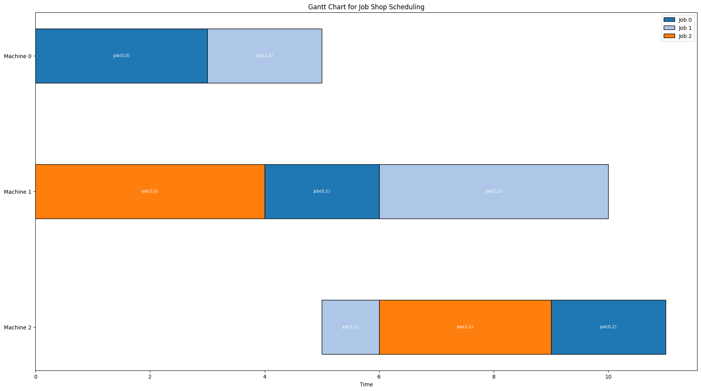

# Genetic Algorithm for Job Shop Scheduling Problem (JSSP)

[](https://github.com/imiguelrodriguez/GeneticAlgorithm)
[](https://github.com/imiguelrodriguez/GeneticAlgorithm)
[](https://github.com/imiguelrodriguez/GeneticAlgorithm/blob/main/LICENSE)

## Overview

This repository provides an implementation of a **Genetic Algorithm (GA)** for solving the **Job Shop Scheduling Problem (JSSP)**. The JSSP is a classic optimization problem where jobs, each consisting of a sequence of tasks, must be scheduled on specific machines to minimize the total makespan while adhering to job order and machine availability constraints.

The project also includes an implementation of **Simulated Annealing (SA)** as a comparative optimization method.

## Features

- **Customizable Genetic Algorithm:**
  - Multiple selection methods: Rank-based and Tournament selection.
  - Multiple crossover methods: One-Point and Two-Point crossover.
  - Multiple mutation methods: Independent and Single mutation.
  - Elitism for preserving the best solutions.
- **Simulated Annealing Optimization:**
  - Adjustable cooling rate, initial temperature, and stopping criteria.
  - Efficient single-solution optimization.
- **Visualization Tools:**
  - Gantt charts for visualizing the scheduling of jobs.
  - Fitness progression plots for both GA and SA.
- **Configurable Parameters:** 
  - Population size, mutation rate, cooling rate, etc., are tunable to suit datasets of varying complexity.

## Installation

1. Clone the repository:
   ```bash
   git clone https://github.com/imiguelrodriguez/GeneticAlgorithm.git
   ```
2. Navigate to the project directory:
   ```bash
   cd GeneticAlgorithm
   ```
3. Try the code in the test notebooks

## Usage

### Running the Genetic Algorithm

1. Customize the configuration parameters in the `genetic_algorithm.py` file:
   - **Population size**, **mutation rate**, **selection method**, **crossover method**, etc.
2. Run the Genetic Algorithm:
   ```bash
   python genetic_algorithm.py
   ```
3. The best solution and its Gantt chart will be displayed.

### Running Simulated Annealing

1. Customize the parameters in the `simulated_annealing.py` file:
   - **Initial temperature**, **cooling rate**, and **stopping criteria**.
2. Run Simulated Annealing:
   ```bash
   python simulated_annealing.py
   ```
3. The best solution and its Gantt chart will be displayed.

### Example Datasets

- Small, medium, and large datasets for JSSP are included in the repository. You can find and modify these in the `datasets/` directory.

### Visualizations

Both GA and SA generate:
- **Fitness Progression Plots**: Show how the fitness evolves over iterations.
- **Gantt Diagrams**: Visualize the task scheduling for the best solution.

## Repository Structure

```plaintext
.
├── datasets/                   # Example datasets (small, medium, large)
├── genetic_algorithm.py        # Genetic Algorithm implementation
├── simulated_annealing.py      # Simulated Annealing implementation
├── utils.py                    # Utility functions for plotting and execution
├── individual.py               # Class representing a single solution
└── README.md                   # Project documentation
```

## Gantt Diagram Examples

Below is an example Gantt chart generated for the **small dataset**:

``
jobs = [
    [(0, 3), (1, 2), (2, 2)],
    [(0, 2), (2, 1), (1, 4)],
    [(1, 4), (2, 3)]
]
``



## Authors
[Ignacio Miguel Rodríguez](https://github.com/imiguelrodriguez) and
[Mar Vidal Cid](https://github.com/marrviidal)
